## 目次
1.  Flutterとは
1. MacにFlutterをインストール
1. Android 開発環境の準備
1. iOS 開発環境の準備
1. Flutterサンプルアプリの実行
1. エラーの対処方法


## Flutterを使ってみる
春にWebエンジニアデビューをしてから約半年が経ちました。

そしてひょんなことからFlutterを勉強してみることになりました！

調べてみるとFlutter For Webがででているようなので、数年後はもしかするとWebの世界でも流行っているかもしれないので今のうちに勉強していても損はないはず！

そんなこんなで今回はFlutterの第1回目の投稿となります！

### 開発環境

* OS:　MacOS Mojave 10.14.6
* Flutter: 　1.9.1

## 1.  Flutterとは
最近のアプリ開発ではほとんどがAndroidとiOSの両方でリリースをすることが多いと思います。

その場合、フレームワークや開発方法は大きく違うため開発には大きなコストが必要となります。

しかしFlutterはクロスプラットフォームと呼ばれ、同じコードで両方のOSに対応したアプリ開発ができるためかなりの効率化が期待できます。

今回はFlutterでの開発に必要な環境構築と実際にクロスプラットフォームを体感するために、デフォルトのサンプルアプリを起動してAndroidとiOSのどちらでも動作できることを確認していきます。

## 2. MacにFlutterをインストール
まずは[公式ページ](https://flutter.dev/docs/get-started/install:embed:cite)からFlutter本体をインストールします。

<b>MacOS</b>をクリックします。

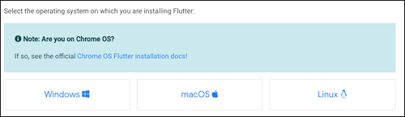

最新の<b>Flutter SDK</b>をダウンロードしてください。

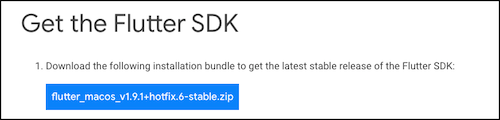

ダウンロードが完了したら、適当な場所で展開します。

私の場合は今回はホームディレクトリにdevelopmentというフォルダを作ります。

```
$ mkdir ~/development
$ cd ~/development
```

ダウンロードしたSDKを先ほど作ったフォルダに移動して解凍します。

```
$ mv ~/Downloads/flutter_macos_v1.9.1+hotfix.6-stable.zip ./
$ unzip ./flutter_macos_v1.9.1+hotfix.6-stable.zip
```

Flutterコマンドを使えるように`解凍したフォルダのパス/flutter/bin`PATHを通します。

```
export PATH="$PATH:/Users/username/development/flutter/bin"
```

試しにFlutterのバージョンを表示してみましょう！
```
$ flutter --version
Flutter 1.9.1+hotfix.6 • channel stable • https://github.com/flutter/flutter.git
Framework • revision 68587a0916 (9 weeks ago) • 2019-09-13 19:46:58 -0700
Engine • revision b863200c37
Tools • Dart 2.5.0
```

これで最初の第一歩、<b>Flutterのインストール</b>が完了しました！

ついでに~/.bashrc等にFlutterコマンドのaliasも設定しておきましょう！
```
alias fl='flutter'
```

## 3. Android 開発環境の準備
Flutterをインストールしたら、次はAndroid Studioをインストールしていきます。

Android StudioはAndroidアプリの統合開発環境のことです。

もし既にインストールされている方は、Flutterのプラグインをインストールする所までスキップしてください。

### Android Studioのインストール
まずは[公式ページ](https://developer.android.com/studio?hl=ja)にいってダウンロードしましょう！


ダウンロードが完了したらdmgファイルを開いてApplicationフォルダにドラッグ&ドロップします。
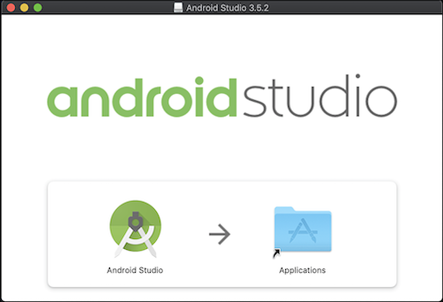


### Android StudioにFlutterプラグインのインストール
インストールしたら、まずはAndroid Studioを起動しましょう。

起動したら右下のConfigureからPlugginを選択します。


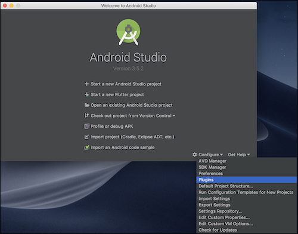

ここでFlutterを検索してインストールします(画像は既にインストールしてしまってます)

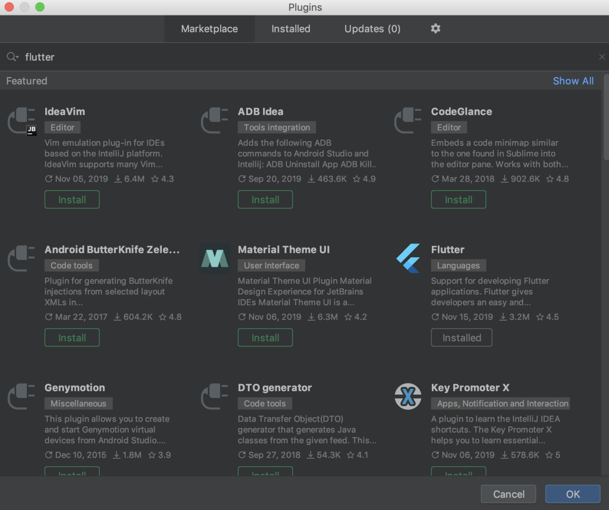

### ちょっと一休み 〜 Flutter doctorで診断する
ここで一度Flutter doctorというコマンドを紹介します！

flutter doctorとはFlutterに関連するセットアップが完了しているかチェックをしてくれます。

もしNGだった場合は必要なコマンドなども表示してくれるため非常に優しい仕様になってます。

ぜひ一度チェックしてみてください！

```
$ flutter doctor
Doctor summary (to see all details, run flutter doctor -v):
[✓] Flutter (Channel stable, v1.9.1+hotfix.6, on Mac OS X 10.14.6 18G103, locale ja-JP)

[!] Android toolchain - develop for Android devices (Android SDK version 29.0.2)
    ✗ Android licenses not accepted.  To resolve this, run: flutter doctor --android-licenses
[!] Xcode - develop for iOS and macOS (Xcode 11.2.1)
    ✗ Xcode requires additional components to be installed in order to run.
      Launch Xcode and install additional required components when prompted.
    ✗ CocoaPods not installed.
        CocoaPods is used to retrieve the iOS and macOS platform side's plugin code that responds to your plugin usage on the Dart
        side.
        Without CocoaPods, plugins will not work on iOS or macOS.
        For more info, see https://flutter.dev/platform-plugins
      To install:
        sudo gem install cocoapods
[✓] Android Studio (version 3.5)
[!] VS Code (version 1.39.2)
    ✗ Flutter extension not installed; install from
      https://marketplace.visualstudio.com/items?itemName=Dart-Code.flutter
[!] Connected device
    ! No devices available
```

例えば `[!] VS Code (version 1.39.2)` というのがNGになっていますが、VSCodeからFlutterのプラグインをインストールするとOKになりました！


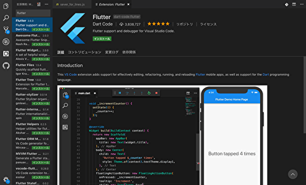

## Androidエミュレーターの設定
さぁいよいよAndroid環境の設定はこれで最後となります。

まずはエミュレーター(Virtual Device)をコマンドラインから作成します。(最後のAndroidは任意の命名)

```
$ flutter emulator --create --name Android
Emulator 'Android' created successfully.
```

もしここでエラーが出た場合は対処方法を最後に書いていますのでそちらを確認してみてください。

ここまで上手くいったら最後にエミュレーターを起動してみましょう。

```
$ flutter emulator --launch Android
```

このようにAndroidエミュレーターが表示されれば成功です！


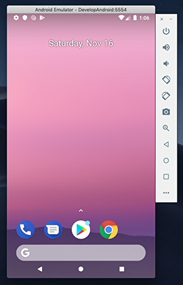


## 4. iOS 開発環境の準備
まずはXcodeをインストールしましょう。

ただXcodeはMacであれば大体は入っているかと思いますので、説明は省きます。

FlutterはXcode9.0以上である必要がありますのでご注意ください。


次にXcodeの設定変更をします。

```
$ sudo xcode-select --switch /Applications/Xcode.app/Contents/Developer
```

そしてライセンスの同意を行います。

```
$ sudo xcodebuild -license
```

最後にAndroidと同様にiOSエミュレーターを起動してみます。
```
$ open -a Simulator
$ flutter emulator --launch apple_ios_simulator
```

この通り、iOSエミュレーターが表示されれば無事成功です！


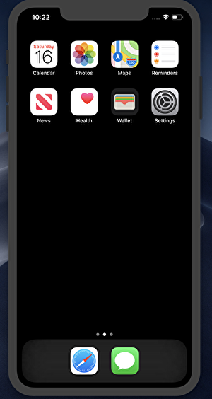

お疲れ様です。これでAndroidとiOSのFlutter環境構築が完了しました。

環境構築だけであればここで終わりとなりますが、せっかくなのでFlutterのサンプルアプリをビルドして、AndroidとiOSのどちらもサンプルアプリが動くことまで体感してみます。

## 5. Flutterサンプルアプリの実行
Windowsの方もいるかと思いますのでAndroid Studioをつかっていきます。

とても簡単なのであとちょっと頑張ってください！

まずはAndroid Studioを起動し、<b>[Start a new Flutter project]</b>を押してください。

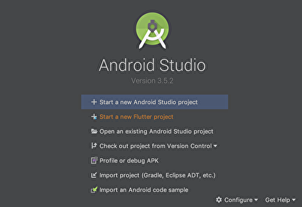

<b>[Flutter Application] -> [Next]</b>を選択します。

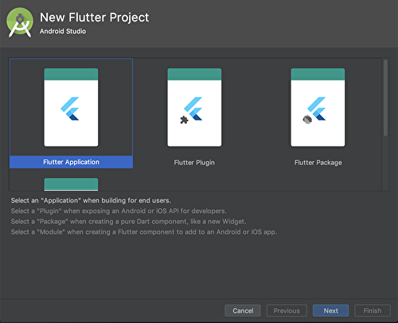

次にプロジェクト名等を入力してください。<b>[flutter_first_appp]</b>など。

今回はそれ以外は変更する必要はありません。最後に<b> [Next] </b>を押します。

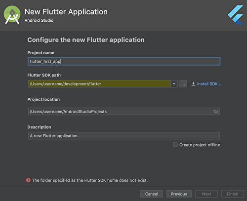

そしてパッケージ名に利用するCompanyDomainを設定します。

パッケージ名はユニークである必要がありますが、ここではサンプルなのでそのままにします。

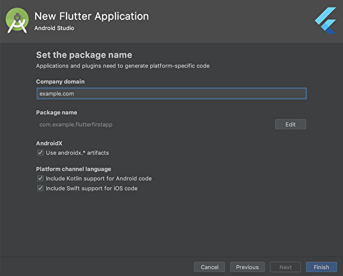

ここまで完了したらこのようなプロジェクト画面が開くはずです。

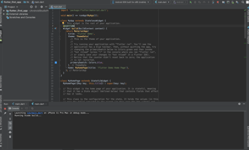

ではサンプルアプリをビルドしてみましょう！！

Androidであれば右上をAndroidを選択してRunボタンを！
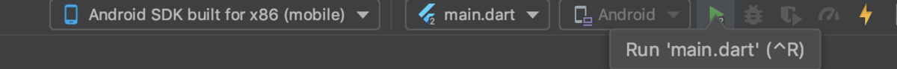

iOSであればいiPhoneを選択してRunボタンを！
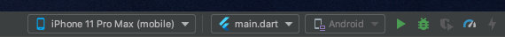

そうすればこのようにそれぞれのエミュレーターが起動することを確認できました！！

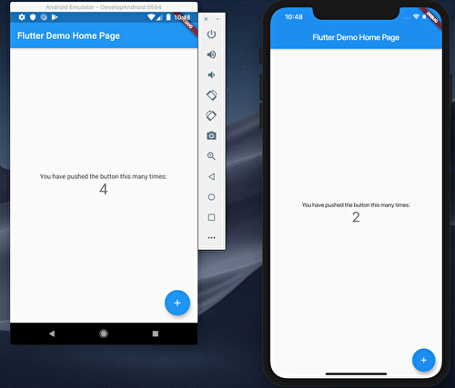

## さいごに
はじめてのFlutterでしたが、とても簡単に構築することができました。

今回はサンプルアプリを実行しただけですが、次からはもう少し踏み込んだ内容をまとめたいと思います。

連載できるように頑張ります！！！

# エラー対処
## Failed to create emulator ***
```
$ flutter emulator --create --name Android
Failed to create emulator Android'.

No suitable Android AVD system images are available. You may need to install these using sdkmanager, for example:
  sdkmanager "system-images;android-27;google_apis_playstore;x86"

You can find more information on managing emulators at the links below:
  https://developer.android.com/studio/run/managing-avds
  https://developer.android.com/studio/command-line/avdmanager
```

この場合はエラー内で表示されているように下記コマンドを打ってください。
```
$ sdkmanager "system-images;android-27;google_apis_playstore;x86"
sdkmanager: command not found
```

私の場合、さらにsdkamanagerのパスが通ってないようでエラーとなりました。

sdkmanagerは`/Users/username/Library/Android/sdk/tools/bin`に実態がありますのでパスを通します。

```
# Android Studio
export ANDROID_HOME=~/Library/Android;
export ANDROID_SDK_ROOT=$ANDROID_HOME/sdk;
export PATH=$ANDROID_SDK_ROOT/tools/bin:$PATH;
```


##  NoClassDefFoundError: javax/xml/bind/annotation/XmlSchema
```
Exception in thread "main" java.lang.NoClassDefFoundError: javax/xml/bind/annotation/XmlSchema
```

これがでたらJava8系が入っていないようです。

そのため[Oracleのページ](https://www.oracle.com/technetwork/java/javase/downloads/jdk8-downloads-2133151.html)からJava8のJDKをインストールしましょう！(JREではないです！)

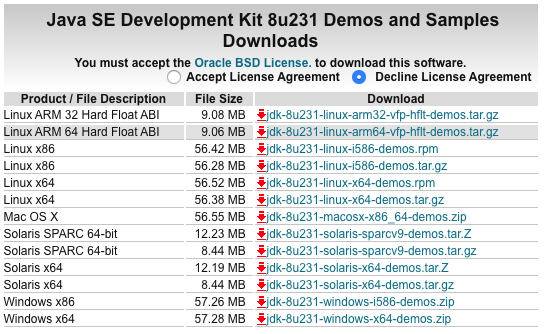

もし別のJavaが入っているなら[この辺り](https://qiita.com/ringo/items/db58b34dc02a941b297f#java_home-%E3%82%B3%E3%83%9E%E3%83%B3%E3%83%89)を参考にすれば良いと思います！
